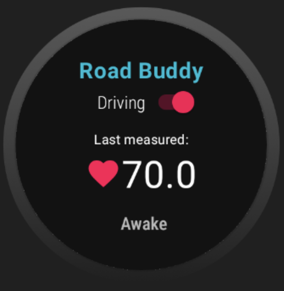
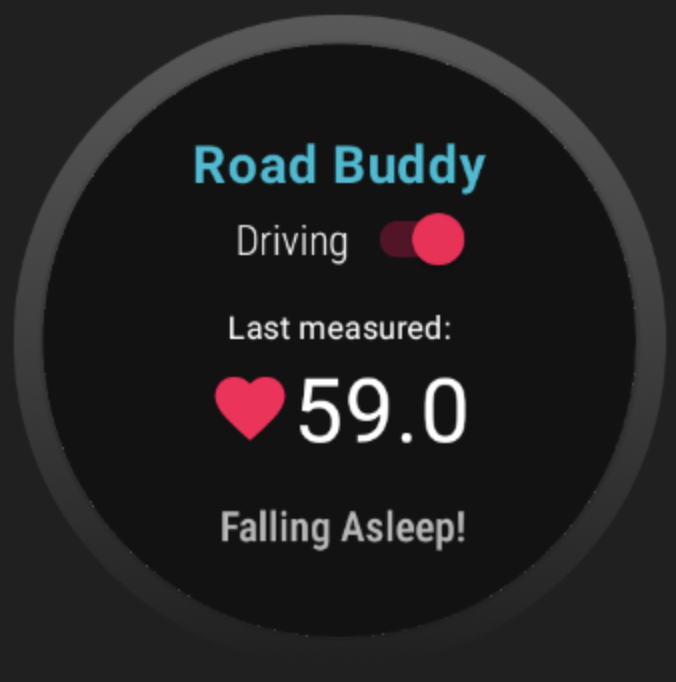

## Hackathon_McWICS_2023 🙌
: Hackathon_McWICS is the annual hackathon run by the McGill Women in Computer Science. 

 

<h4>[ Duration ]🙋‍</h4>
- Feb 4, 2023 to Feb 5, 2023 (2023 Winter, COMP 353 Databases )

 
 

<h2> Contributers </h2>

| NAME | 
| --- | 
| Suin Kang | 
| Hyun Soo Kim | 
| Sarah Michelle Ang |
| Sooah Kil |

 
 

## 1. RoadBuddy 🚙

Drowsy driving accounts for ~20% road accidents in Canada. Road Buddy is an application that helps prevent drowsy driving accidents. It is developed for WearOS using Android Studio and Kotlin.  

<h3>💡Concepts💡</h3>
- We wanted to address one of GM's vision, "Zero Crashes". Although it may be virtually impossible to completely eliminate all accidents, we concentrate on preventing those that could happen due to drowsy driving which accounts for over 20% of road accidents in Canada. Research shows when people get drowsy, their heart rate is reduced. We developed a WearOS smartwatch app to send vibrations waking the user up when they're falling asleep while driving.

<h3>🎯Our solution🎯</h3>
- We used a Health Services API in Wear OS that could monitor heartbeats. The API measures the current heart rate from a synthetic data provider which we used to calculate the average heart rate. The app sends a vibration to the driver when current heart rate falls below the average.

 

<h4>Challenges we ran into</h4>
- It was our first time to use Android studio, Kotlin and develop Android Wear OS. We needed to learn many new technologies and how to work with WearOS API.

<h4>What's next for RoadBuddy</h4>
- The drop in heart rate can be caused by factors other than drowsy driving. To address this, we could record the users' other relevant health information to provide an accurate prediction of when they are sleeping.  
- We can add voice alert to wake driver more effectively. 
- The app can also use Google Maps API to send vibrations and alerts to drivers when they exceed the speed limits in areas with high accident rates or child protection zones. 
- Also, we can use Google Maps API to send notices about the closest resting stop when the driver is feeling drowsy. 
- In the future, this app can connect with the car system so autonomous driving mode will take over when the driver falls asleep. 

<h4>Devpost</h4>
https://devpost.com/software/roadbuddy-lio7xt

<h4> Reference </h4>
https://www.ncbi.nlm.nih.gov/pmc/articles/PMC6393761/
https://tc.canada.ca/en/road-transportation/statistics-data/canadian-motor-vehicle-traffic-collision-statistics-2020  
https://developer.android.com/training/wearables/apps/standalone-apps  
https://developer.android.com/training/wearables/health-services  
https://developer.android.com/training/wearables/health-services/synthetic-data  
https://developer.android.com/reference/android/os/VibrationEffect  
https://github.com/android/health-samples  
***

